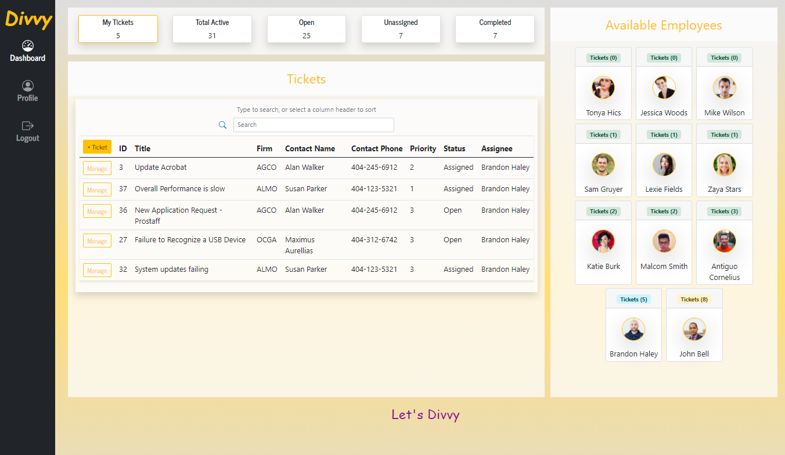
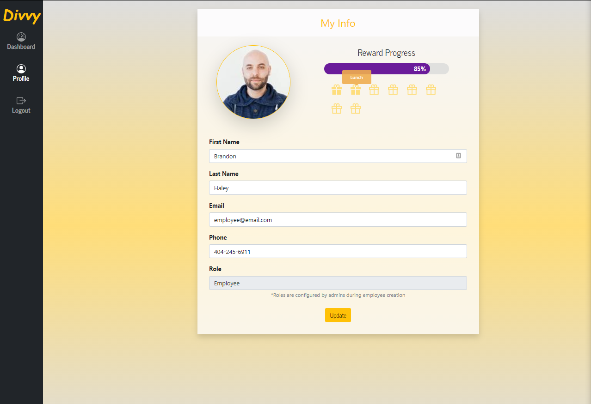
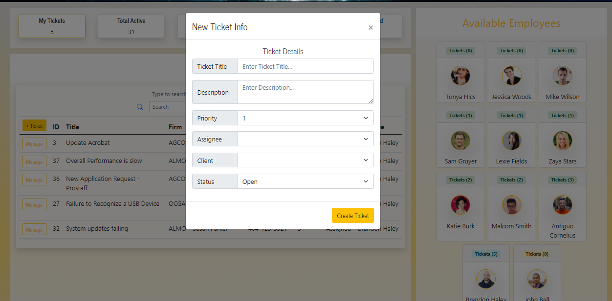

# Divvy

## General 📖
---    
- Github:    https://github.com/Kyle7286/Divvy
- Deployed Site: https://safe-lake-16466.herokuapp.com/

- Rockstar Collaborators: 
     [John Bell](https://github.com/jdbell123) 
     [Ryan Johnson](https://github.com/wryanj) 
     [Brandon Haley](https://github.com/kyle7286) 

## About/Purpose ❔
---
Divvy is the ultimate solution for a busy task-driven team who values a crisp and friendly user interface while also displaying data in a elegant and smart way
Divvy is for...
* Organizations with multiple teams who work via ticket requests
* Managers who want an all-in-one solution for delegating tasks and managing their employees
* Employees who want a crisp and clean user interface that is simple to use and doesn’t get tiring to look at day after day
 

## How to Use
---
1. Sign up
2. Create a Team
3. Create Employees
4. Create Clients
5. Setup your profile picture
6. Begin adding tickets
7. Assign tickets to employees
8. Sign in as the employee
9. Work tickets

## Key Features
---
* Create an organization
* Create employees
* Create clients
* Configure your profile
* Manager tickets
* Assign Tickets
* Create new tickets
* Comment in tickets
* Close tickets
* Gain rewards for closing tickets
* Filter Ticket data on the fly
* View Employees most available

## Technology Used
---
* HTML
* CSS
* Vanilla JS
* Bootstrap 5
* SQL
* Sequelize
* React
* React-tables
* React-mobile
* React-modal
* React-tooltips Nodemailer
* Underscore JS
* Express
* Express Session

## Screenshot(s) 📊
---

## Video
---

## Thank you 👍 
---
Thank you for your time checking out our website! It means a lot to us :)