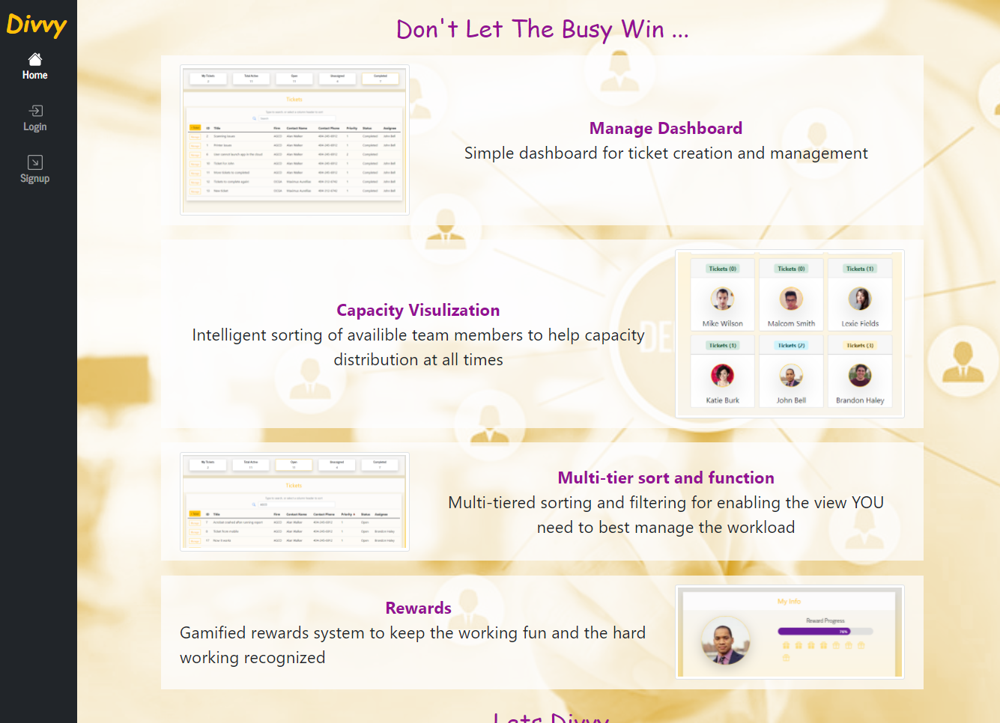

# Project 3

## General 📖
---    
- Github:    https://github.com/Kyle7286/project-3
- Deployed Site: 
- Presentation: 
- Video: 

- Rockstar Collaborators: 
     [John Bell](https://github.com/jdbell123) 
     [Ryan Johnson](https://github.com/wryanj) 
     [Brandon Haley ](https://github.com/kyle7286) 

## About/Purpose ❔
---
Lorem Ipsum

## How to Use
---
1. Lorem Ipsum
2. Lorem Ipsum
3. Lorem Ipsum

## Technology Used
---
* Lorem Ipsum
* Lorem Ipsum
* Lorem Ipsum    

## Screenshot(s) 📊
---

## Thank you 👍
---
Thank you for your time checking out our website! It means a lot to us :)